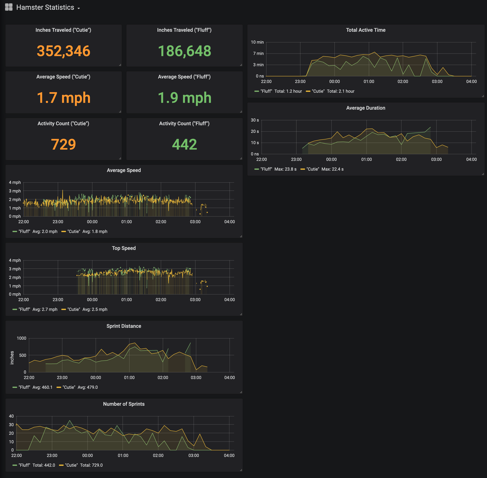

# Hamster Wheel Speedometer

Yes you heard right, this is a speedometer for a hamster wheel. 

## Project Overview
The project consists of measurement hardware, and a data collection and visualization backend. For visualization I use Grafana. For data persistence I use Elasticsearch. Logstash provides a convenient means of collecting the data, filtering it, and passing it to Elasticsearch for indexing, as well as a Kafka topic. The Kafka topic is just a little something extra I include in my data pipelines, so that I can set up event notifications, triggers, and things like that. 

## Grafana Statistics Dashboard

## Raspberry Pi with ADC HAT

The ADC Hat is a 16-bit ADS1115 module. I'm using two of the four inputs for speed measurement. I take advantage of the Raspberry Pi's built-in Wi-Fi, which eliminates the need for a wired network connection. The Pi module plugs into power, and the two speedometer wires lead to each of the two hamster habitats for data collection. 

## Wheel Speed Sensors installed
Notice the tiny magnet that's glued to the wheel. As it spins around, this magnet passes by the coil, inducing a small current that is easily measured by the ADC

The wheel speed sensor is a simple inductive coil with about 100 turns. The coil runs back to the ADC input block, where it I have added an additional 1k resistor to ground which helps reduce noise and inductive reverberations.

## Inductor Coils

Breathing life back into old USB charger cables that got bent and no longer would charge. I snipped the USB ends off and just used the wire. They conveniently came with pre-installed ferrite chokes, which certainly won't hurt, and probably help prevent ambient EMI noise from inducing spurrious readings. 

## Observations

TODO: include interesting observations. Eg. The hamsters start their exercise about 10 minutes after the lights go out, and typically exercise for N minutes each night. When one hamster starts running, the other tends to start too. 