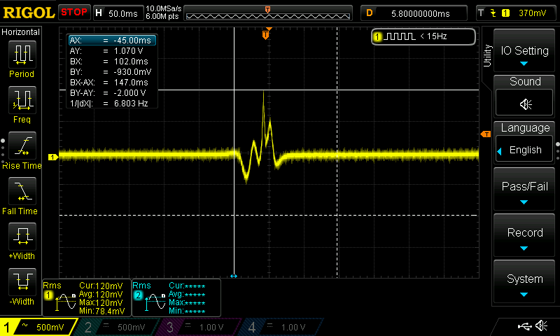

# Hamster Wheel Speedometer

Yes you heard right, we're measuring how far and how fast the hamsters run each night =)


## Purpose

Data science is a hobby and a large part of my profession. By building things in my home lab, I gain experience in an environment where I can use the latest technology without any real risks. The systems I build in my lab give me the hands-on experience with emerging technologies, as well as a risk free environment to try things, solve problems, and come up with new ways to do things. All of that translates to higher productivity and effectiveness in my professional work. 

## Project Overview

Our kids have pet hamsters...

The goal is to measure two things: 1: Distance, and 2: Speed, of the hamsters using wheel speed sensors and home-grown software code to analyze the data. All data thus far is gleaned from simply measuring RPM (number of times the wheel turns per minute), which leads to MPH (miles per hour, which is easily calculated by multiplying RPM by each wheel's unique distance per revolution). 

The project has three main parts: measurement hardware, measurement software, and a data collection and  visualization backend. For visualization I use Grafana. For data persistence I use Elasticsearch. Logstash provides a convenient means of collecting the data, filtering it, and passing it to Elasticsearch for indexing, as well as a Kafka topic. The Kafka topic is just a little something extra I include in my data pipelines, so that I can set up event notifications, triggers, and things like that. I've set up alerts for other projects that notify me of network security events, electric grid outages/events, and so on. 


## Grafana Statistics Dashboard


## Raspberry Pi with ADC HAT

The ADC Hat is a 16-bit ADS1115 module. I'm using two of the four inputs for speed measurement. I take advantage of the Raspberry Pi's built-in Wi-Fi, which eliminates the need for a wired network connection. The Pi module plugs into power, and the two speedometer wires lead to each of the two hamster habitats for data collection. 


## Wheel Speed Sensors installed
Notice the tiny magnet that's glued to the wheel (bottom, near center). As it spins around, this magnet passes by the coil, inducing a small current that is easily measured by the ADC

The wheel speed sensor is a simple inductive coil with about 100 turns. The coil runs back to the ADC input block, where I have added an additional 1k pull-down resistor, which helps reduce noise and inductive reverberations. I affixed the sensor to the habitat in a way that doesn't leave the wires within reach of the hamster, which they would invariably chew on if within reach. During the calibration phase of the project, the kids and I took measurements of each wheel, and recorded the measurements on the yellow tape you see on the wheel. They did the experiments, and most of the writing. 


## Inductor Coils

Breathing life back into old USB charger cables that got bent and no longer would charge... I snipped the USB ends off and re-used the cable. They conveniently came with pre-installed ferrite chokes, which help mute ambient EMI noise from inducing spurrious readings. 

The inductor coils (wheel speed probes) are just an air-core coil of wire with a 1k pull-down at the ADC.


When a magnet passes by the coil an electrical impulse is generated, which is what the ADC measures, and the software detects, cleans up, and turns into events. 



## Observations

The hamsters start their exercise about 10 minutes after the lights go out. They both typically exercise for about four hours before calling it a night. The two hamster habatats are situated side by side. When one hamster starts running the other tends to start too, although at times, the data seems to suggest that Fluff doesn't start significant exercise until after Cutie's wheel cools down for a while. Cutie's wheel does make a lot of racket and may be intimidating to Fluff. Future experiment: oil the wheel and see if this increases Fluff's activity. 

## Data Schema

Every time the wheel stops spinning for more than about 2 seconds, the current set of metrics for that wheel are summarized, packaged up, and sent to the log collection backend (Elasticsearch, via logstash). Each wheel speed sensor (analog input) is tracked independently. 

Individual messages look something like this: 

``` json
{
  "appUptimeSeconds": 2778,
  "runTimeSeconds": 13.9,
  "mph": 1.546,
  "timestamp": 1575351483019,
  "rpm": 83.739,
  "statsPeriod": 21999,
  "lastRevolutionMillis": 794,
  "@version": "1",
  "@timestamp": "2019-12-03T05:38:03.057Z",
  "totalRevolutions": 23,
  "queuedms": 0,
  "mph_max": 1.976,
  "AvgAmtChange": 9.027,
  "analogIndex": 2,
  "totalInches": 448.5,
  "host": "x.x.x.x"
}

```

Which Elasticsearch happily consumes with basically no effort at all. In Grafana then, I've built a dashboard that connects to Elasticsearch, and aggregates the data. Data from each of the two wheels is separated by the analogIndex field, which corresponds to the ADC HAT input index (each wheel gets its own ADC input index). The wheel speed probes each attach to an analog input. This field lets me distinguish metrics for one hamster versus the other. 

## Calibration

Before "going live" the kids and I drew up the project on paper and discussed each component. We each took turns taking measurements of the wheels, and installing the wheel speed sensor magnets. The measurements we took included: radius, each kid's height and width, the cat's height, and wheel circumfrence. Not all measurements were needed but the kids tend to get carried away when they are inspired. We checked, and double-checked the most important metric (circumfrence) by rolling the wheel on the table next to a tape measure and writing down each measurement. We eliminated the bad measurements, and averaged the most accurate ones. 

In the [python application](hamster.py), a wide range of calibrations and logic had to be added to carefully measure each revolution once and only once. The signal coming into the ADC is a typical impulse signal, where the waves grow rapidly to a peak and then decline rapidly. By defining a trigger threshold, and trigger direction, I wrote code that detects each revolution very effectively and thus far doesn't show any signs of invalid data (we'll see in a few weeks when I have more data to look at too).

## Running the application

```
# use a .env file to store environment variables. Read it into memory, and then invoke the application. 

. ./.env; export EVENT_RECEIVER_URL; python ./hamster.py 

```

## Sample app output

App output varies from day to day but generally I try to collect and print key metrics that help understand and tune the application over time. In the sample below, the analog index is the number shown in square brackets, followed by the running stats data, which is updated once per wheel revolution, and transmitted to the data collection server after two seconds of inactivity.

``` json

[3] New run starting...
[3] {"startupTime": 1575348705017, "AvgAmtChange": 15.04, "lastResetTime": 1575352757025, "statsPeriod": 51993, "mph": 0, "lastRevolutionTime": 1575352772084, "mph_max": 0, "runStartTime": 1575352771172, "analogIndex": 3, "totalInches": 42, "totalRevolutions": 2, "rpm": 0, "runTimeSeconds": 0.91, "lastRevolutionMillis": 913}
[3] {"startupTime": 1575348705017, "AvgAmtChange": 16.686, "lastResetTime": 1575352757025, "statsPeriod": 51993, "mph": 0.646, "lastRevolutionTime": 1575352772798, "mph_max": 1.293, "runStartTime": 1575352771172, "analogIndex": 3, "totalInches": 63, "totalRevolutions": 3, "rpm": 32.5, "runTimeSeconds": 1.63, "lastRevolutionMillis": 912}
[3] {"startupTime": 1575348705017, "AvgAmtChange": 17.879, "lastResetTime": 1575352757025, "statsPeriod": 51993, "mph": 1.158, "lastRevolutionTime": 1575352773435, "mph_max": 1.67, "runStartTime": 1575352771172, "analogIndex": 3, "totalInches": 84, "totalRevolutions": 4, "rpm": 58.25, "runTimeSeconds": 2.26, "lastRevolutionMillis": 714}
[3] {"startupTime": 1575348705017, "AvgAmtChange": 11.12, "lastResetTime": 1575352757025, "statsPeriod": 51993, "mph": 1.514, "lastRevolutionTime": 1575352774012, "mph_max": 1.869, "runStartTime": 1575352771172, "analogIndex": 3, "totalInches": 105, "totalRevolutions": 5, "rpm": 76.125, "runTimeSeconds": 2.84, "lastRevolutionMillis": 637}
[3] {"startupTime": 1575348705017, "AvgAmtChange": 22.522, "lastResetTime": 1575352757025, "statsPeriod": 51993, "mph": 1.781, "lastRevolutionTime": 1575352774528, "mph_max": 2.048, "runStartTime": 1575352771172, "analogIndex": 3, "totalInches": 126, "totalRevolutions": 6, "rpm": 89.563, "runTimeSeconds": 3.36, "lastRevolutionMillis": 577}
[3] {"startupTime": 1575348705017, "AvgAmtChange": 28.967, "lastResetTime": 1575352757025, "statsPeriod": 51993, "mph": 2.044, "lastRevolutionTime": 1575352775045, "mph_max": 2.307, "runStartTime": 1575352771172, "analogIndex": 3, "totalInches": 147, "totalRevolutions": 7, "rpm": 102.781, "runTimeSeconds": 3.87, "lastRevolutionMillis": 516}
[3] {"startupTime": 1575348705017, "AvgAmtChange": 31.413, "lastResetTime": 1575352757025, "statsPeriod": 51993, "mph": 2.175, "lastRevolutionTime": 1575352775601, "mph_max": 2.307, "runStartTime": 1575352771172, "analogIndex": 3, "totalInches": 168, "totalRevolutions": 8, "rpm": 109.391, "runTimeSeconds": 4.43, "lastRevolutionMillis": 517}
TRANSMITTING EVENT: {"timestamp": 1575352779019, "queuedms": 1, "appUptimeSeconds": 4074.0, "mph": 2.151, "mph_max": 2.307, "AvgAmtChange": 25.489, "analogIndex": 3, "totalInches": 168, "totalRevolutions": 8, "lastRevolutionMillis": 556, "rpm": 108.196, "runTimeSeconds": 4.43, "statsPeriod": 21994}
Successfully sent one reading to log collecrtor. DE-queueing one reading!

```

## TODO

1. Create a systemd service unit to run the application
1. Experiment with different ways to increase the hamsters' activity levels, such as quieting down their wheels (so they aren't scared to run in them), rearranging the layout, moving them away from eachother (prevent one from being scared by the other's noise), various foods, ...
1. Code cleanup. Credits. 


